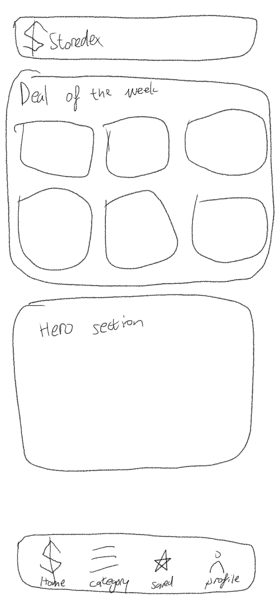
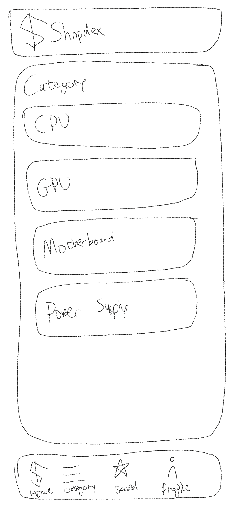
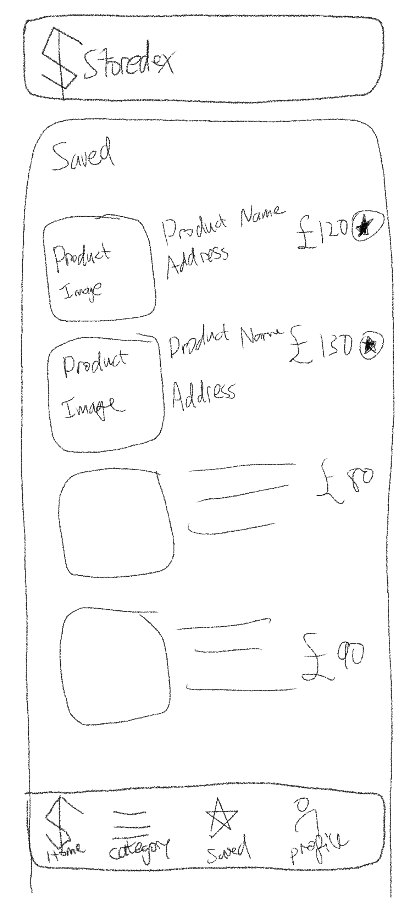
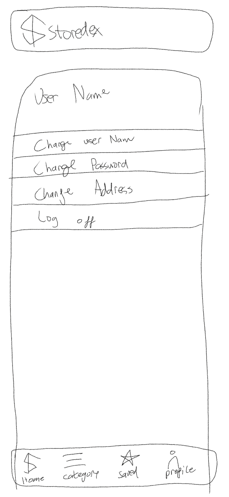
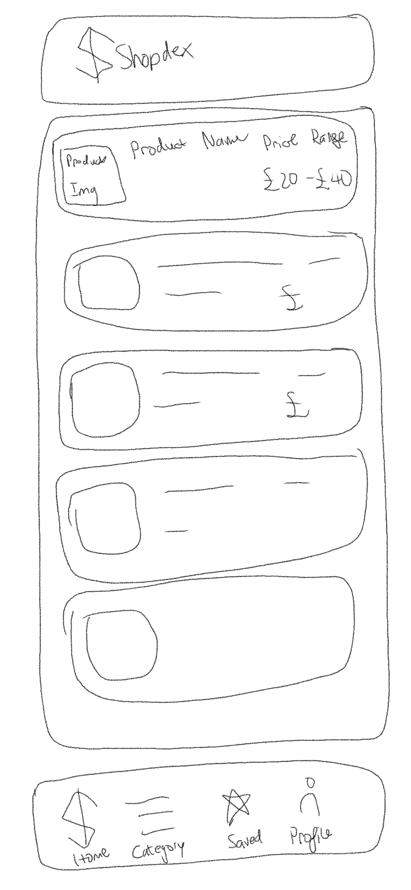
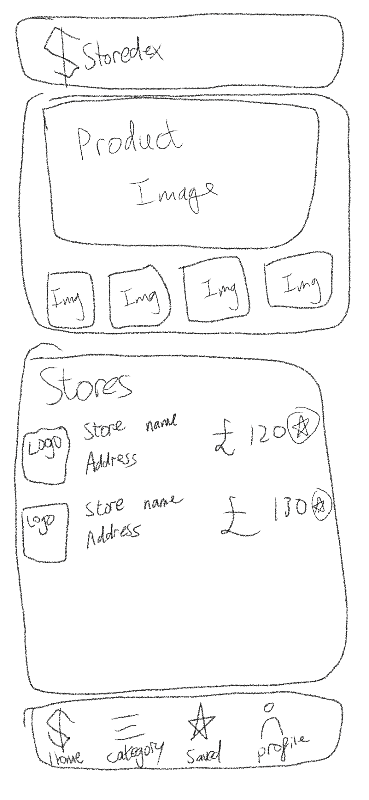
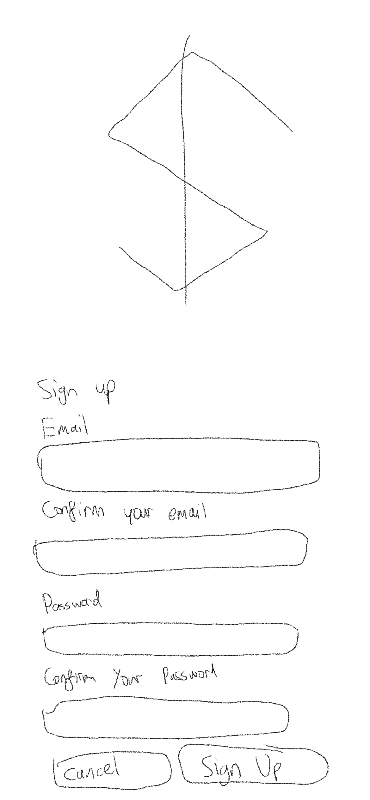

# Shopdex

Shop + Index = Shopdex

## Overview

<!-- What is your app? Brief description in a couple of sentences. -->

<!-- My app will show you all the prices that is available for that specific product. These products are also in stock in a physical store, so customers can just visit the store, and get the product they want that day without waiting for shipping. -->

My app does price comparions for shops with in stock items. It tells you prices of the the products and shops around you that has it. Discover the cheapest product the user desires that is in stock at physical stores.

### Problem

<!-- Why is your app needed? Background information around any pain points or other reasons. -->

It is very hard to find a shop with the cheapest price to buy a product espeically when it comes to shopping in person. Some people would like to shop something in person so they get to try it, see it in real life and getting the product the same day instead of waiting for it to be shipped.

### User Profile

<!-- Who will use your app? How will they use it? Any special considerations that your app must take into account. -->

People who would like to find the cheapest shop for the product they want, try it and get it in a physical store in the same day. The Website will mostly be used on a smart phone because customers will be on the move searching for the cheapest store.

### Features

<!-- List the functionality that your app will include. These can be written as user stories or descriptions with related details. Do not describe _how_ these features are implemented, only _what_ needs to be implemented. -->

- Login
- Change user name
- Change password
- Logout

- Search bar that will auto complete
- Save products that you are interested

- shop owners should be able to upload their pricing and location for their product
- User should be able to browse the all the products listed on the website

- product price chart
- google map shows the shops

## Implementation

### Tech Stack

<!-- List technologies that will be used in your app, including any libraries to save time or provide more functionality. Be sure to research any potential limitations. -->

- react
- react-router-dom
- sass
- axios
- uuid
- express
- knex

### APIs

<!-- List any external sources of data that will be used in your app. -->

- I will be building my own api
- Maybe a map api, either google, mapbox or open street view

### Sitemap

<!-- List the pages of your app with brief descriptions. You can show this visually, or write it out. -->

- Home Page /

Home page is what users will see when they go on the website.

- Category Page /category

ALl the products in their catagory that is uploaded to the database.

- Saved Page /user/:id/saved

All the products that the user have saved

- Profile Page /user

This is where user can change their user name, password, email and logout

- Product List Page

The page after searching for a product in the search bar

- Product Page /products/:id

This page shows the product details and all the available prices from different shops

- Signup Page /signup

User signup page

- Login Page /login

shop login page

- store owner page /shop/:id

This page shows all the products that the shop has listed.

- upload product page /shop/:id/upload

This is where shop owners upload their available products prices

### Mockups

<!-- Provide visuals of your app's screens. You can use tools like Figma or pictures of hand-drawn sketches. -->

### Data

<!-- Describe your data and the relationships between them. You can show this visually using diagrams, or write it out. -->

- shops

| id  | shop_name | email | password | address | account-created-date |
| --- | --------- | ----- | -------- | ------- | -------------------- |

- saved

| id  | user id | product id |
| --- | ------- | ---------- |

- shops

| id  | address |
| --- | ------- |

- listings

| id  | product_id | shop_id | price | reports |
| --- | ---------- | ------- | ----- | ------- |

- products

| id  | product_name | Brand | Model | category | shop_id |
| --- | ------------ | ----- | ----- | -------- | ------- |

### Endpoints

<!-- List endpoints that your server will implement, including HTTP methods, parameters, and example responses. -->

#### get

/products

- list of all products

/products/:id

- product detail

/products/category

- a list of product that is in that category

<!-- /user/:id

- get user's details -->

#### post

- /store/:id

uploading new product

#### put

/account/shopname/edit

- edit account name

/account/email/edit

- edit account email

/account/password/edit

- edit account password

### Auth

<!-- Does your project include any login or user profile functionality? If so, describe how authentication/authorization will be implemented. -->

shop login

## Roadmap

<!-- Scope your project as a sprint. Break down the tasks that will need to be completed and map out timeframes for implementation. Think about what you can reasonably complete before the due date. The more detail you provide, the easier it will be to build. -->

- folder structure
- setup database
- setup backend
- setup frontend
- home page
- category page
- saved page
- profile page

## Nice-to-haves

<!-- Your project will be marked based on what you committed to in the above document. Under nice-to-haves, you can list any additional features you may complete if you have extra time, or after finishing. -->

- dark mode / light mode
- admin page
- signup with google / twitter / facebook
- parts compatibility

## Instructions

setup `.env`

The token for mapbox is

`REACT_APP_MAPBOX_TOKEN= pk.eyJ1IjoibGVpZ2h0b24tZ3VhbmciLCJhIjoiY2xwYWNxYWhxMDZuNTJrazdseXM4NDR4NSJ9.E62MYzRpMnGaazE2NUFufQ`

run `npm i`